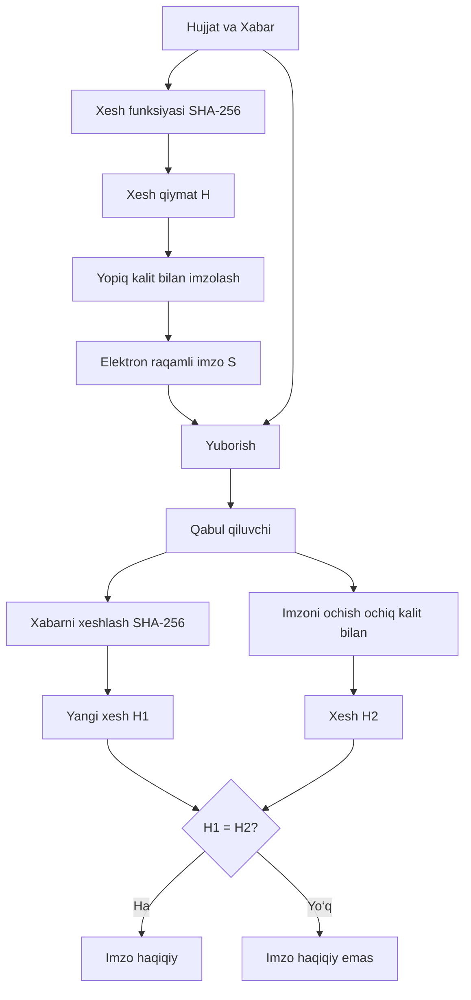
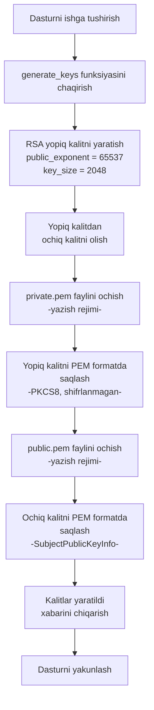
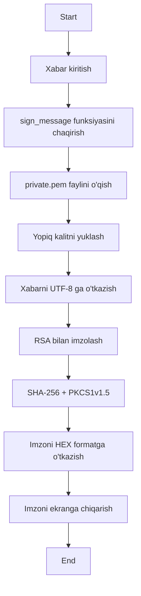

# kiberxavfsizlik---




```mermaid
flowchart TD
    A[Dasturni ishga tushirish] --> B[Foydalanuvchidan xabar kiritish]
    B --> C[Foydalanuvchidan imzo HEX kiritish]

    C --> D[verify message funksiyasini chaqirish]
    D --> E[Imzoni HEX baytga o‘tkazish]
    E --> F[public pem faylini ochish o‘qish rejimi]
    F --> G[Ochiq kalitni xotiraga yuklash]

    G --> H[Xabarni UTF-8 formatga o‘tkazish]
    H --> I[Xabarni SHA-256 bilan xeshlash]

    I --> J[RSA bilan imzoni tekshirish PKCS1v1.5 padding]
    J --> K[Natijani aniqlash: IMZO TO‘G‘RI / NOTO‘G‘RI]

    K --> L[Natijani foydalanuvchiga chiqarish]
    L --> M[Dasturni yakunlash]

